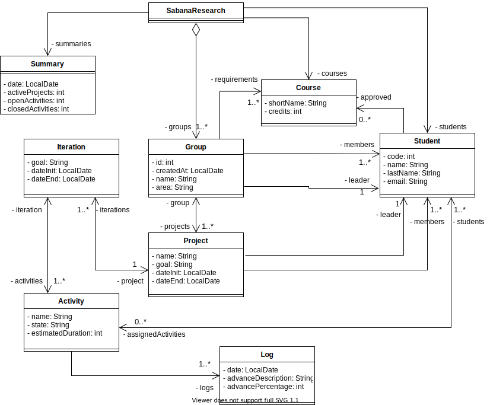
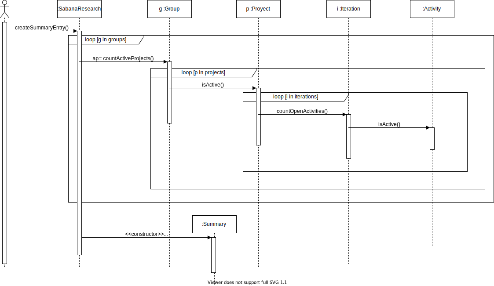

# POOB-TEST-FIRST-SABANA-RESEARCH

La Universidad de la Sabana quiere desarrollar un sistema de información para los grupos de interés de la comunidad de estudiantes. Estos grupos tienen como objetivo desarrollar proyectos innovadores en un área específica de conocimiento. Cada grupo tiene un líder responsable de aprobar y dar seguimiento a los proyectos que se ejecutan en su grupo. Los estudiantes pueden inscribirse a diferentes grupos de interés, si cumplen con los requisitos académicos definidos para cada uno de ellos, pero sólo pueden ser líderes de un grupo. La decanatura ha designado a los estudiantes de POOB de este semestre para construir la solución que permita.

* **Crear grupos de Interés:** La Universidad es la responsable de aprobar los grupos: su tema de investigación y los prerrequisitos definidos para sus miembros. Los grupos para crearse deben contar como mínimo con dos miembros, uno de ellos debe ser el líder.
* **Inscribir estudiantes**: Los líderes de los grupos deciden si aprueban o no a un estudiante después de verificar los requisitos académicos.
* **Crear proyectos:** Los líderes de los grupos se encargan de aprobar los proyectos propuestos por los estudiantes miembros. Los proyectos son ejecutados por varios estudiantes y se encuentran divididos en iteraciones, cada iteración tiene un conjunto de actividades. 
* **Evaluar proyectos:** Los líderes evalúan periódicamente el estado de avance de cada una de las actividades: el resultado de estas evaluaciones quedan en el log de seguimiento de las mismas. Las actividades pueden estar en cuatro diferentes estados: *pending*, *active*, *canceled*, *closed*. Cuando todas las actividades han finalizado se considera que un proyecto está terminado.



## I. (25%) MEMORIA

Presente el mapa de memoria correspondiente a:

* El grupo *Cerebritos* no tiene pre-requisitos y su líder es *Marge*. Tiene un proyecto activo llamado *MyPad* el cual está conformado por *Apu*, líder del proyecto, y *Moe*. Este proyecto cuenta con 2 iteraciones. 

1. Para la iteración 1, las actividades son: *Diseño del logo* y *Crear repositorio de código*.
2. Para la iteración 2, las actividades son: *Construir MVP* y *Encuestar Usuarios*.  

* El grupo *MegaTransporte* tiene como requisito el curso *Programación Básica*, el líder es *Peñalosa* y tiene los siguientes miembros: *Moe*, *Barney* y *Lisa*. 

1. *Lisa* curso con éxito *Programación Básica*. 
2. *Moe* pertenece al proyecto *Monorriel* y actúa como líder de este proyecto cuyo objetivo es *Mejorar la movilidad de la ciudad*.

## II. (35%) CÓDIGO

* Estudie el diagrama de secuencia, las especificaciones de los métodos y la documentación del API Java.
* Actualice el diagrama de clases considerando el diseño presentado. Agregue todos los métodos que hagan falta.
* Escriba el código correspondiente al encabezado y atributos de la clase responsable inicial. No olvide documentar el invariante.
* Implemente cada uno de los métodos correspondientes a la solución. No olvide documentar cada uno de los métodos involucrados.



## III. (20%) DISEÑO

Diseñe un método de la clase EciGrupos (especificación y diagrama de secuencia decorado) que permita inscribir un estudiante a un grupo de interés. No olvide validar las condiciones de inscripción.

## IV. (20%) Conceptos

1. ¿Qué es encapsulamiento? ¿Qué ventajas ofrece?
2. ¿Qué es ocultación de información? ¿Por qué aplicarla? ¿Cómo se implementa en Java?

## V. (20%) Bono

* Modifique el diagrama de secuencia para calcular el número de actividades abiertas y el número de actividades cerradas.
* Escriba el código necesario y las pruebas para validar esta funcionalidad.

## Condiciones

1. Puede encontrar los editables de los diagramas en este [enlace](https://unisabanaedu-my.sharepoint.com/:u:/g/personal/diegopt_unisabana_edu_co/ESYDrd-h2lFDjnEWv7D6qmIBMd89yuTTzS1Q7P4d68IUjQ?e=g9OcpW).
2. Puede acceder a todos los recursos que considere necesarios, excepto pedirle ayuda a un tercero.
3. El examen se calificará contra un conjunto de pruebas que no esta adjunto al parcial, sin embargo el mismo cuenta con un conjunto de pruebas modelo, piense en casos que pueden no estar cubiertos en el mismo.
4. Revise la clase [LocalDate](https://docs.oracle.com/javase/8/docs/api/java/time/LocalDate.html) de Java.

## Entrega

Siga al pie de la letra estas indicaciones para la entrega de este punto. EL HACER CASO OMISO DE ESTAS INSTRUCCIONES PENALIZARÁ LA NOTA.

1. Configure su usuario de GIT

```bash
$ git config --global user.name "Juan Perez"
$ git config --global user.email juan.perez@unisabana.edu.co
```

2. Desde el directorio raíz (donde está este archivo README.md), haga commit de lo realizado. Mantenga su repositorio privado hasta después de la entrega del parcial, entonces hagalo publico.

```bash
$ git add .
$ git commit -m "entrega parcial - Juan Perez"
```

3. Desde este mismo directorio, comprima todo con: (no olvide el punto al final de la instrucción)

```bash
$ zip -r APELLIDO.NOMBRE.zip .
```

4. Abra el archivo ZIP creado, y rectifique que contenga lo desarrollado.

5. Suba el archivo antes creado (APELLIDO.NOMBRE.zip) en el espacio de Teams correspondiente.

6. IMPORTANTE!. Conserve una copia de la carpeta y del archivo .ZIP.

7. Haga commits recurrentes para verificar su progreso, UN PARCIAL SOLUCIONADO EN 1 SOLO COMMIT SE CONSIDERA COPIA.
 
