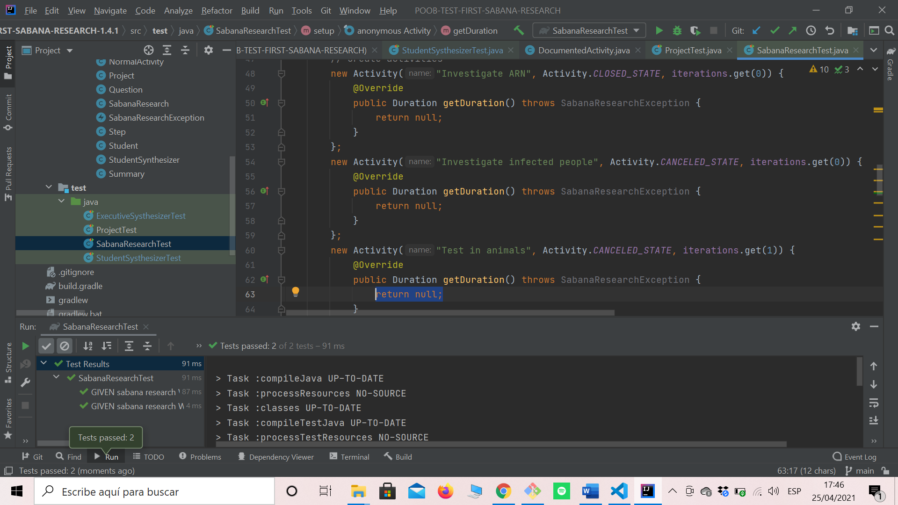

# PARCIAL 1

## Conceptos 
1. ¿Qué es encapsulamiento? ¿Qué ventajas ofrece?
El encapsulamiento en programación se refiere a la limitación de acceso de una propiedad a ciertos elementos que deben ser utilizados exclusivamente. La encapsulación mantendrá ocultos los procesos internos y no podrán modificarse, así el programador solo tendrá acceso a los métodos ya definidos. Esto ofrece dos ventajas: las acciones del usuario se pueden controlar desde el interior y se podrán realizar cambios sin afectar la interacción de estos con la aplicación.

2. ¿Qué es ocultación de información? ¿Por qué aplicarla? ¿Cómo se implementa en Java?
La ocultación mantendrá ocultos los procesos internos del comportamiento de una clase y no podrán modificarse, así el programador solo tendrá acceso a los métodos ya definidos. Este concepto es utilizado para restringir y controlar la clase ya que habrá elementos a los cuales no van a poder acceder otras clases y se podrá modificar el estado de estas. En java esta se implementa por medio de los métodos public, private y protected.

## Mapa de memoria

## Diagrama de secuencia

# PARCIAL 2

## Conceptos

1. ¿Cuáles son las acciones los tres momentos importantes de las excepciones? ¿Cuál es el objetivo de cada una? ¿Cómo se implementa en Java cada acción?.

Los 3 momentos importantes de las excepciones son try, catch y finally. El bloque try  contendrá el código que puede producir una excepción en caso se un error, el bloque catch contiene el código con el que se va a tratar el error y el bloque finally contiene el código que se va a utilizar para regular el programa sea haya producido una excepción o no.

2. ¿Qué es sobreescritura de métodos? ¿Por qué aplicarla? ¿Cómo impedir que se sobre escriba un método?.

La sobreescritura de métodos permite implementar en la subclase un método heredado para que funcione de acuerdo a lo que se le pide y no a lo definido en la clase padre. El compilador busca el método de abajo arriba hasta que lo encuentra definido, de lo contrario, utilizará el de la superclase.

## Diagrama de secuencia

## Diagrama de clases

## Diagrama de clases modificado

# EVIDENCIA

