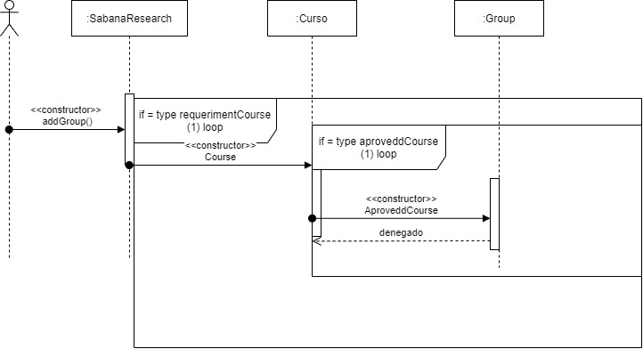

## SOLUTION.md

# Parcial 1

- Conceptos 
1. ¿Qué es encapsulamiento? ¿Qué ventajas ofrece?
El encapsulamiento en programación se refiere a la limitación de acceso de una propiedad a ciertos elementos que deben ser utilizados exclusivamente. La encapsulación mantendrá ocultos los procesos internos y no podrán modificarse, así el programador solo tendrá acceso a los métodos ya definidos. Esto ofrece dos ventajas: las acciones del usuario se pueden controlar desde el interior y se podrán realizar cambios sin afectar la interacción de estos con la aplicación.

2. ¿Qué es ocultación de información? ¿Por qué aplicarla? ¿Cómo se implementa en Java?
La ocultación mantendrá ocultos los procesos internos del comportamiento de una clase y no podrán modificarse, así el programador solo tendrá acceso a los métodos ya definidos. Este concepto es utilizado para restringir y controlar la clase ya que habrá elementos a los cuales no van a poder acceder otras clases y se podrá modificar el estado de estas. En java esta se implementa por medio de los métodos public, private y protected.

- Mapa de memoria

- Diagrama de secuencia
